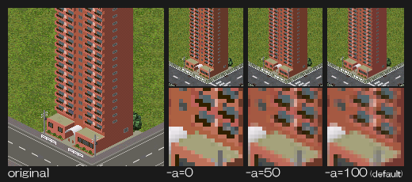
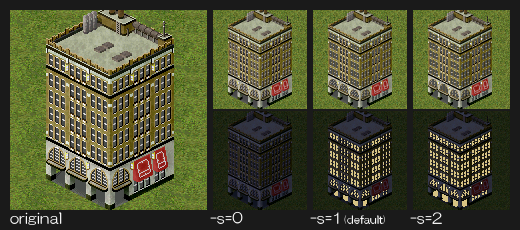
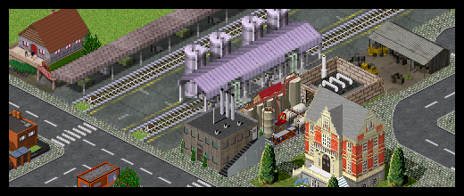

# resizeobj
resizeobjはsimutransのpak128用のPAKファイルをpak64でも利用できるように変換するコマンドラインアプリケーションです。

# ダウンロード

[resozebjはリリースページからダウンロードできます](https://github.com/wa-st/resizeobj/releases)

# インストール/アンインストール

特別な操作は不要です。
レジストリへの書き込み等は行いません。

# 使い方
resizeobj.exeのフルパスをc:\work\resizeobj.exe、変換したいPAKファイルの名前をbuilding.example1.pakだとすると、コマンドプロンプト上で、

```
c:\......>c:\work\resizeobj.exe building.example1.pak
```

と打ち込めばresizeobjを実行できます。コマンドプロンプトでの作業が面倒ならresizeobj.exeのアイコン上に変換したいファイル(複数可)をドラッグ＆ドロップして実行するのもありです。

resizeobj.exeを実行すると、building.example1.pakが存在するのと同じフォルダにbuilding.example1.64.pakという名前のファイルが作成されます。これが変換されたファイルなのでこれをsimutransのpakフォルダに放り込めばOKです。

複数ファイルを一気に変換したい場合は下のようにスペース区切りで指定したりワイルドカードを利用したりできます。

```
c:\......>c:\work\resizeobj.exe building.example1.pak building.example2.pak ......
c:\......>c:\work\resizeobj.exe building.*.pak
```

# コマンドラインオプション

## -A=0...100
画像縮小時のアンチエイリアス量を指定します。『-A=0』でアンチエイリアス無し、『-A=100』でアンチエイリアス強めとなります。



## -S=0...2
画像縮小時の特殊色(発光色・プレイヤー色)の扱いを指定します。

|値|処理|
|---|---|
|0|特殊色を使用せず縮小します。夜間に発光しなくなるかわりに奇麗なアンチエイリアスがかかります。|
|1|縮小元エリアの左上が特殊色の場合にその特殊色を出力します。(既定値)|
|2|縮小元エリアで特殊色が半数以上使用されている場合にその特殊色を出力します。|



## -W
変換後のアドオンのタイルサイズを指定します。規定値は「64」です。
例えば、Pak64からPak32に変換する際には「-W=32」と指定します。

## -K
元ファイルの画像データを縮小せずそのまま大きな画像を使用する「原寸大モード」で変換します。


原寸大モードが使用できるのは、一部の建築物(駅舎・待合室/倉庫・役所・本社・工場・ランドマーク)のみです。 市内建築物や記念碑などは原寸大モードを利用できません。

## -Ka
原寸大モードで建築物を変換する際にアニメーションを取り除きます。

## -X
pak64用のアドオンをpak128で使用する「拡大モード」で変換します。pak64用の画像を無理やり2倍に拡大するだけなので、見た目は非常に悪くなります。


## -M=OFFSET
アドオンの画像を指定されたピクセル数だけ下にずらす「縦移動モード」で
変換します。規定値は「4」です。

## -E=EXTENSION
出力するファイルの拡張子を指定します。既定値は「.64.pak」です。

## -T=TEXT
アドオン名の先頭に指定された文字列を付け加えます。アドオン名が他のアドオンと衝突する場合などにどうぞ。

## -N
ファイルヘッダの書き換えを行いません。

## -D
エラー発生時にダイアログを表示しません。

## -? , -H
コマンドラインオプションを表示します。

# 更新履歴

## ver 1.6
- simutrans 120.4以降用のmakeobj 60.2に対応
- 原寸大モードの車両変換機能を削除
- 縦移動モード(-M)追加
- ソースの整理

## ver 1.5(2012/12)
- simutrans 112.0以降用のmakeobj 55に対応
- 「原寸モード」の名称を「原寸大モード」に変更
- ソースの整理

## ver 1.4(2012/03/18)
- simutrans 111.2以降用のmakeobj 53に対応
- ライセンスをNYSLに変更した

## ver 1.3(2011/07/18)
- 拡大モード(-Xオプション)追加

## ver 1.2(2011/05/08)
- simutrans 110以降用makeobj51に対応
- -Wオプション追加
- -Lオプション削除
- ログの出力量を削減
- 古い形式の画像データ(IMG ver1)を含む乗り物を原寸モードで変換した場合、プレイヤーカラーがずれる問題を修正
- 元から画像がマイナスオフセットされているアドオンを正常に変換できない問題を修正
- 「resizeobj con」で標準入出力からPAKファイルを読み書きできるようにした。
- ログの出力先を標準出力から標準エラーに変更
- 開発環境をVC2008からVC2010に変更

## ver 1.1(2009/10/12)
- 原寸モード追加
- 乗り物もデフォルトでは画像縮小を行うようにし、オフセット調整機能は原寸モードに移動。
- -Eオプション追加
- -Dオプション追加
- 変換元ファイル名に"."を含まずフォルダ名に"."を含む場合に出力ファイル名が変になるバグを修正
- 非空白画像を縮小した結果 空白画像に転じた場合、不正なPAKファイルが出力されるバグを修正
- ver 0.2 beta(2009/7/21)
- PAKファイルの名前に日本語が含まれているとエラーが出るバグを修正
- エラー表示をコンソール出力するだけでなくエラーダイアログでの表示も行うように変更

## ver 0.1 beta(2009/7/18)
- 初公開
